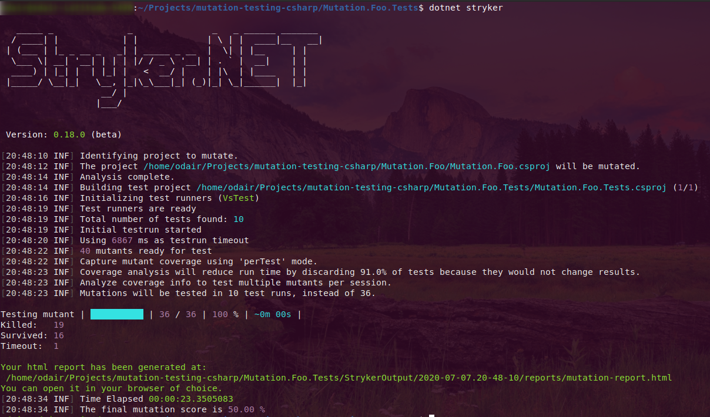
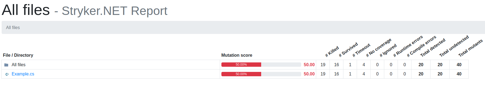
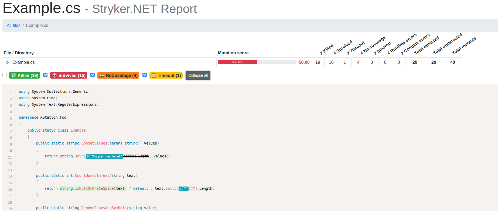

# Mutation Testing with C# and .NET Core

|Project|Build|Mutation Score|
|--|--|--|
|Mutation.Foo|[](https://github.com/odair-pedro/mutation-testing-csharp/actions?query=workflow%3ABuild)|[](https://dashboard.stryker-mutator.io/reports/github.com/odair-pedro/mutation-testing-csharp/master-mutation-foo)|
|Mutation.Store.Example|[](https://github.com/odair-pedro/mutation-testing-csharp/actions?query=workflow%3ABuild)|[](https://dashboard.stryker-mutator.io/reports/github.com/odair-pedro/mutation-testing-csharp/master-mutation-store-example)|

---

It is a simple example to demonstrate you how to implement mutation testing into your .NET Core/C# application

## What mutation testing is?
Mutation testing is an approach to help you to check if your unit tests are effective enough.

The main idea is to create a mutant code which is a modified version of your code and run the existing unit tests against this mutant code, instead of original code.
If the mutation code break tests, it mean that the mutant has killed, which is good. If the mutation code doesn't break tests then the mutant survived, which is not so good. In other words... we espect that the unit tests fails:

`mutated code + failed tests = killed mutant` :heavy_check_mark:

`mutated code + passed tests = survived mutant` :x:

### Basic mutation examples

#### Arithmetic operators

|Original|Mutated|
|--|--|
|var value = a + b;|var value = a – b;|
|var value = a * b;|var value = a / b;|

#### Equality operators

|Original|Mutated|
|--|--|
|if (a == b) { … }|if (a != b) { … }|
|if (a > b) { … }|if (a < b) { … }|

#### Logical operators

|Original|Mutated|
|--|--|
|if (a && b) { … }|if (a \|\| b) { … }|
|if (a \|\| b) { … }|if (a && b) { … }|

#### Negation operator

|Original|Mutated|
|--|--|
|var x = y;|var x = !y;|
|if (!x) { … }|if (x) { … }|


---


## How to implement?
In our example we have used [Stryker.NET](https://github.com/stryker-mutator/stryker-net). The [Stryker Mutator](https://stryker-mutator.io/) implementation for .NET Core/Framework


### Stryker
First of all we need to install Stryker.NET tool. For that we have two installation options. Locally, just for a specific project. Or globally, that can be used by any other project.

#### Local Installation
To install locally run the follow commands on root folder of your test project:

``` 	
dotnet new tool-manifest
```

```
dotnet tool install dotnet-stryker
```

#### Global Installation
To install globally run the follow command:

```
dotnet tool install -g dotnet-stryker
```

#### Usage
Bellow is the command to run Stryker.NET. Just execute it in your test project's root folder:

```
dotnet stryker
```

And then, you may to see something like the screen bellow:



#### Report
After each execution Stryker generate a report. 

The default type is a HTML page containing a dashboard, where you can see all the mutations generated and wich mutation has killed or survived on your project.





----

And is that! You can find more examples with Stryker and CI pipelines (GitHub Actions) in this repository. Explore!! I hope you enjoy :smiley:


## References

https://stryker-mutator.io/ 

http://csharp.academy/mutation-testing/
